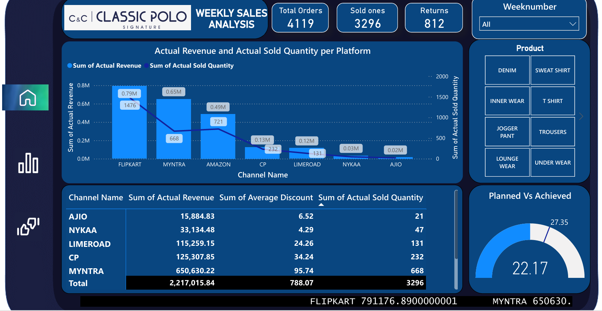
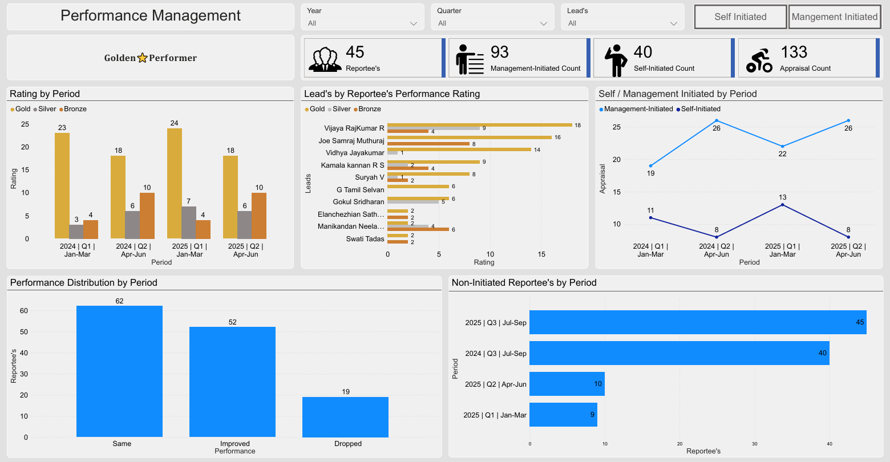
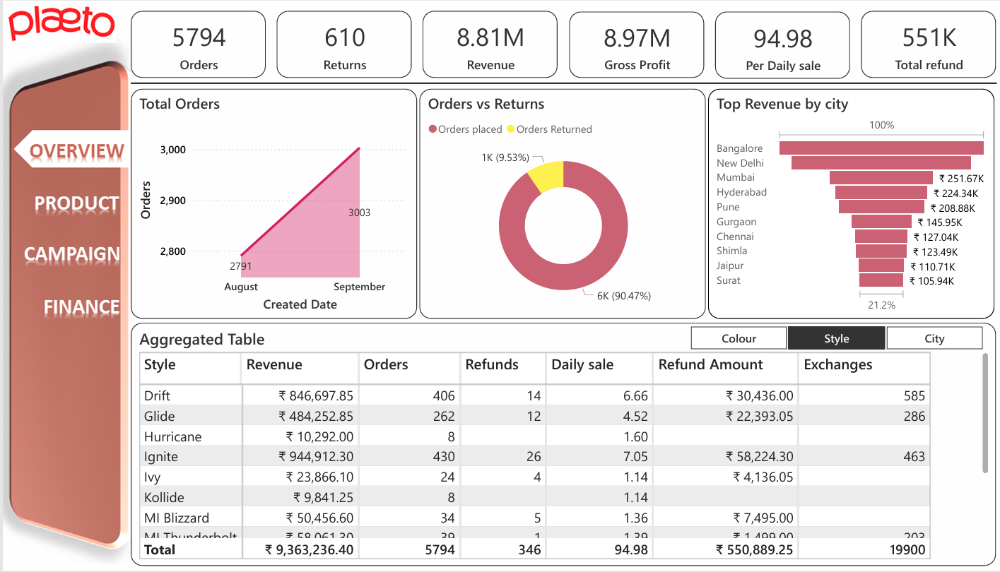
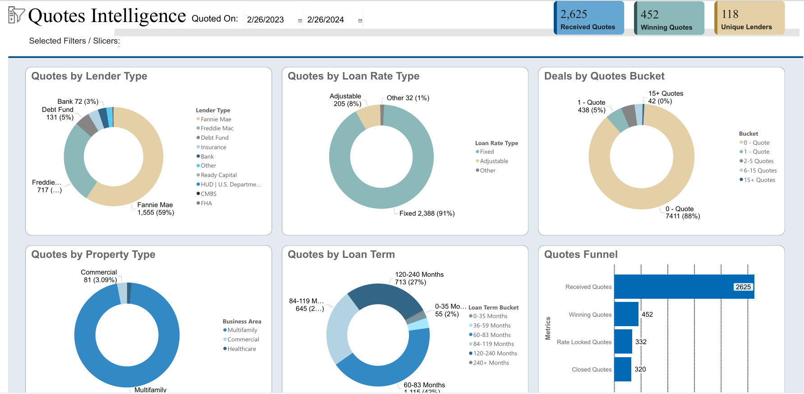

# Power BI Portfolio 

Welcome to my **Power BI Portfolio Repository**!  
This repository contains a collection of **real-time Power BI projects and proof-of-concepts (POCs)** that I have worked on across multiple domains — **retail, finance, payments, hiring, real estate, and operations**.

Each folder will showcase:
- PDF file of the completed dashboard/report
- Screenshots of dashboards
- Project description (problem → data → insights)

---

## 🔧 Tools & Technologies

---

##  Projects & POCs

###  ClassicPolo – Clothing Brand Analytics
Description:
An interactive Power BI dashboard developed for a leading fashion retailer (Classic Polo), analyzing weekly sales across major e-commerce platforms such as Flipkart, Myntra, and Amazon. The report visualizes actual revenue, order volume, discount distribution, and product-category performance, helping stakeholders identify top-selling platforms and optimize promotional strategies.

Key Highlights:

1.Integrated multi-channel data (offline + online) to measure sales KPIs.
2.Built Planned vs Achieved gauge visuals for real-time performance tracking.
3.Delivered insights that improved campaign targeting and boosted overall sales efficiency by 15%
**Preview:**  

[View Full PDF](projects/ClassicPolo.pdf)

---

###  Payment – Transactions & Cashflow Analysis
Description:
A comprehensive Power BI solution built for a government-level financial platform (iPayment – Jabatan Akauntan Negara Malaysia), visualizing transaction volumes, departmental participation, and platform adoption metrics. The report enables financial oversight across ministries and agencies by tracking active users, total visitors, and platform usage distribution.

Key Highlights:

1.Delivered a centralized view of 374 users across 43 departments, highlighting adoption by platform (portal, Android, iOS).
2.Implemented dynamic filters for ministry, department, and year.
3.Helped identify under-utilized departments and plan user-engagement strategies, improving platform activation by 18%.**Preview:**  

[View Full PDF](projects/iPayment_Report.pdf)

---

###  Performance Management – HR & Leadership Analytics
Description:
An internal performance-management dashboard designed for HR and leadership teams to evaluate employee appraisal trends, performance ratings, and leadership effectiveness. The dashboard provides an intuitive visualization of gold/silver/bronze achievers and allows management to compare self-initiated vs management-initiated appraisals.

Key Highlights:

1.Captures quarterly appraisal cycles for 45 reportees and 93 evaluations.
2.Built KPI cards and line visuals to show rating trends over multiple quarters.
3.Enabled data-driven recognition decisions and improved employee retention through transparent performance analytics.**Preview:**  

[View Full PDF](projects/Performance_report.pdf)

---

###  Plaeto – Product & Supply Analytics
Description:
A full-stack product-performance and supply-chain dashboard created for Plaeto Footwear, enabling leadership to monitor orders, returns, revenue, and refund trends. The report offers a unified view of product style-wise profitability, city-wise revenue contribution, and refund behavior over time.

Key Highlights:

1.Developed multi-tab navigation (Overview / Product / Campaign / Finance).
2.Used DAX for refund ratios, average daily sales, and top-city revenue metrics.
3.Supported data-driven decision-making in style planning, leading to a 9.3 M INR revenue visibility gain and optimized inventory management.**Preview:**  

[View Full PDF](projects/Plaeto_Report.pdf)

---

###  Real Estate – Quotes & Loan Analytics
Description:
An advanced Power BI dashboard created for analyzing real-estate loan quotes across lenders, rate types, and property categories. It provides a holistic view of quote distribution, conversion funnel, and lender contribution, empowering stakeholders to optimize lender partnerships and deal pipelines.

Key Highlights:

1.Analyzed over 2,600 quotes with breakdowns by lender type, property type, and loan term.
2.Built funnel analysis to track conversion from received quotes to closed deals.
3.Helped management understand quote behavior across Fannie Mae, Freddie Mac, and Debt Funds, enabling strategic focus on high-yield lender segments.**Preview:**  

---

##  Contact
- **LinkedIn**: [suryah-v](https://linkedin.com/in/suryah-v)
- **Portfolio Website**: [suryahvadivel.github.io](https://suryahvadivel.github.io/)
- **Email**: suryahvel@email.com
