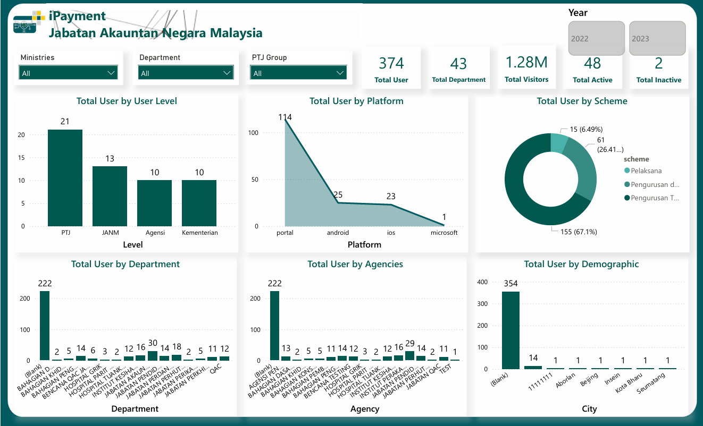

# Power BI Portfolio 

Welcome to my **Power BI Portfolio Repository**!  
This repository contains a collection of **real-time Power BI projects and proof-of-concepts (POCs)** that I have worked on across multiple domains — **retail, finance, payments, hiring, real estate, and operations**.

Each folder will showcase:
- PDF file of the completed dashboard/report
- Screenshots of dashboards
- Project description (problem → data → insights)

---

## 🔧 Tools & Technologies

---

## 📊 Projects & POCs

## 📊 Featured Power BI Projects

### 👕 ClassicPolo – Clothing Brand Analytics
A Power BI dashboard analyzing sales performance, revenue trends, and profitability of a clothing brand to identify top-performing categories and optimize marketing spend.  
**Preview:**  

---

### 💳 Payment – Transactions & Cashflow Analysis
Designed to monitor daily transactions, payment success rates, and collection efficiency. Includes revenue funnel and trend forecasting visuals.  
**Preview:**  

---

### 🧭 Performance Management – Employee KPIs
Performance tracking dashboard for measuring employee productivity, hours utilization, and KPI achievement at project and team levels.  
**Preview:**  

---

### 📦 Plaeto – Product & Supply Analytics
A detailed supply-chain dashboard tracking product movement, stock status, and vendor performance, ensuring optimized lead times and cost efficiency.  
**Preview:**  

---

### 🏠 Real Estate – ROI & Property Insights
A real-estate analytics dashboard highlighting ROI trends, occupancy rates, and investment opportunities across multiple properties and locations.  
**Preview:**  

---

##  Contact
- **LinkedIn**: [suryah-v](https://linkedin.com/in/suryah-v)
- **Portfolio Website**: [suryahvadivel.github.io](https://suryahvadivel.github.io/)
- **Email**: suryahvel@email.com
